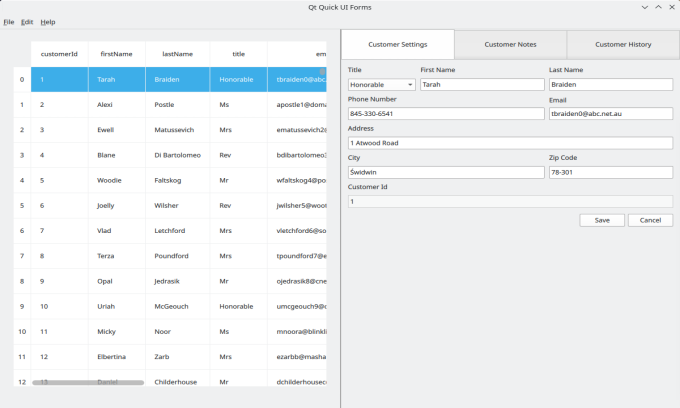

# uiforms demo

`uiforms demo` is a desktop app example based on the example project `qtquickcontrols-uiforms-example` from [https://stuff.mit.edu/afs/athena/software/texmaker_v5.0.2/qt57/doc/qtquickcontrols/qtquickcontrols-uiforms-example.html](https://stuff.mit.edu/afs/athena/software/texmaker_v5.0.2/qt57/doc/qtquickcontrols/qtquickcontrols-uiforms-example.html).

`uiforms demo` connects to a database to get the existing customers, visualize them in a list, and provide widget controls to modify their details.



### Prerequisites
- Qt 6.5
- docker
- docker-compose

\
Then follow the next steps:

### Install dependency
Install the next lib (for debian based):
```shell
apt install libmysqlclient-dev
```
This will avoid the error that could appear during running the app:
```
QSqlDatabase: QMYSQL driver not loaded QSqlDatabase
available drivers: QPSQL QODBC QMARIADB QMYSQL QSQLITE
```

### Clone the project
Clone the project:
```shell
git clone https://github.com/hameos/uiforms_demo.git
cd uiforms_demo
```

### Launch database
It will create a MariaDB instance that is fed with data provided by customer.csv stored in the folder `data`. To launch the database run:
```shell
cd db
docker-compose up
```

### Run uiforms demo
The folder `uiforms` contains the project, it is built using Qt 6.5, C++ and QML. Open uiforms project with the qt tool `qtcreator`, build it and run the app.
